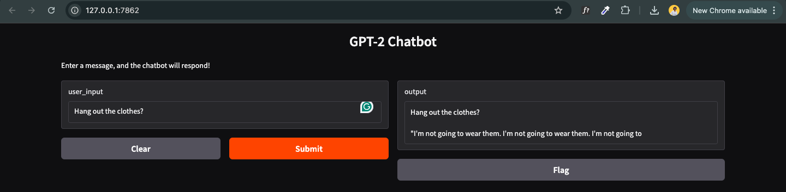

# DailyDialog Chatbot

This repository contains a conversational AI chatbot fine-tuned on the [DailyDialog Dataset](https://aclanthology.org/I17-1099/) using the GPT-2 language model. The bot engages in natural, everyday conversations, making it a fun and practical example of dialogue modeling.

## Project Overview
The chatbot was trained to understand and respond to various conversational topics, emotional tones, and communicative acts found in everyday dialogue. Using GPT-2, it generates responses that align with the flow and context of user interactions. This project aims to:

- Showcase the capabilities of fine-tuning a language model on dialogue data.
- Explore conversational responses that reflect human-like engagement across different topics.
- Offer an accessible interface where anyone can chat with the bot and see language modeling in action.

## Dataset
The model is trained on the [DailyDialog Dataset](https://aclanthology.org/I17-1099/), which includes multi-turn dialogues designed to represent daily interactions. You can download the dataset directly from [here](http://yanran.li/files/ijcnlp_dailydialog.zip).

### Dataset Details:
- **Topics**: Dialogues span various topics including personal life, health, work, and relationships.
- **Emotions**: Conversations capture emotions like happiness, sadness, and surprise.
- **Acts**: Dialogues are categorized by speech acts such as questions, answers, and responses, providing a realistic conversation structure.

## Example Conversations

Below are sample interactions with the chatbot. Each conversation demonstrates the bot’s response style across different scenarios:

**Example 1: Acts**  


**Example 2: Emotions**  


**Example 3: Topics**  


*Add your screenshots to the `images` folder and update these links accordingly.*

## Chatbot Access

watch a short [demo video](https://www.loom.com/share/b850fcdd5b10456b8baee31fc1963659?sid=1b8697da-af09-43d7-81e8-73214105c38a) showcasing the chatbot’s responses.

## Setup Instructions
To get started with this project, follow these steps:

### Clone the Repository
```bash
git clone https://github.com/yourusername/chatbot.git
cd chatbot
```

### Install Requirements
Install the necessary Python packages:
```bash
pip install -r requirements.txt
```

### Run the Chatbot Interface
To launch the Gradio interface and start chatting with the bot:

- Run the notebook: chatbot_training.ipynb

Once you run this command, Gradio will open a local interface where you can test the chatbot.

## Project Files and Structure
- **dailydialog/**: Directory containing the DailyDialog dataset files.
- **chatbot_training.py**: Script used to fine-tune the GPT-2 model on the DailyDialog dataset.
- **model/**: Folder containing the trained model files and tokenizer.
- **images/**: Contains conversation screenshots for README documentation.

## Future Improvements
There are a few potential enhancements for this project:
- **Improving Response Diversity**: Fine-tuning the model further for varied response generation.
- **Emotion-Driven Responses**: Customizing responses based on detected user emotion.
- **Broader Topic Coverage**: Adding more specific topics or using other datasets for domain expansion.

## Acknowledgments
A big thanks to the creators of the [DailyDialog Dataset](https://aclanthology.org/I17-1099/) for their open-source contribution to conversational AI research.
